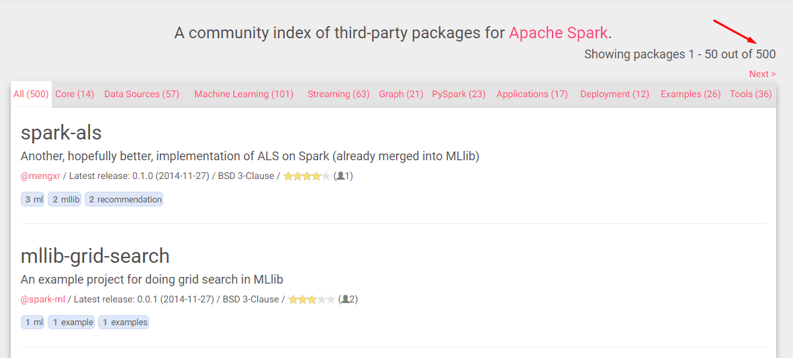
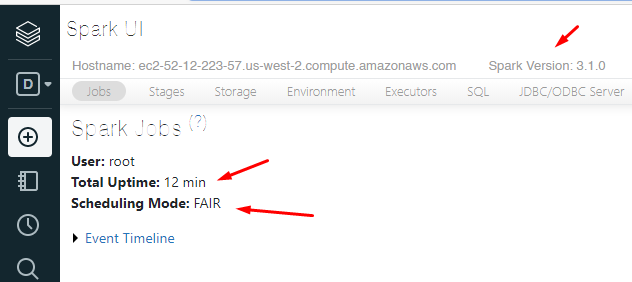
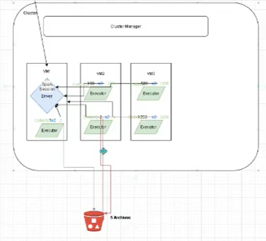

## Objetivos:
- Entender qué es Apache Spark y el funcionamiento
- Comprender la arquitectura de Spark
- ¿Cómo funciona Spark en AWS, Google Cloud y Azure?
- Conocer Databricks

## ¿Qué es Apache Spark?
Es un motor computacional unificado y un conjunto de librerías para el **procesamiento de data en paralelo**. Spark es uno de los proyectos de open source más activos en el mundo. Spark soporta múltiples lenguajes de programación como Python, Java, Scala o R. Posee librerías para diversas tareas como SQL, Streaming y Machine Learning. Puedes ejecutarlo desde en una laptop a miles de servidores. Esto hace que el escalamiento sea simple. [Spark The Definitive Guide, Ch 1]


## Disgreguemos el concepto de Apache Spark
#### **UNIFICADO**
Spark está diseñado para **soportar un gran rango de tareas** de data analytics como por ejemplo una carga de información, ejecución de querys en SQL, algoritmos de Machine Learning y flujos en Streaming. Por jemplo si cargamos data usando una query SQL y luego evaluamos un modelo de Machine Learning sobre ese dataset usando las librerías de Spark, **el engine puede combinar esos pasos para que no se tenga escanear dos veces la data**. 
No es necesario estar generando un output y volviendo a leer en otro lado, etc ...

#### **MOTOR COMPUTACIONAL**
**Spark se centra en el procesamiento**, tomando data de cloud storage systems como Google Cloud Storage, Azure Storage o Amazon S3, además de otros tipos de storage como Apache Hadoop, MySQL o Apache Kafka. Esto significa que **Spark no almacena data**. Es decir existe una separación entre el procesamiento y almacenamiento caso contrario a lo que suscedía con Apache Hadoop (ofrecía Haddop + HDFS obligatoriamente).

#### **LIBRERIAS**
Busca proveer una API unificada para tareas comunes de análisis. Las librerías permiten agregar a Spark nuevas funcionalidades. Por ejemplo librerías para SQL y data estructurada SparkSQL, Machine Learning (MLlib y SparkML), stream processing (Structured Streaming) y análisis de gráfos con GraphX. Además existen muchas más librerías que puedes ver en https://spark-packages.org/ ¿Cuántos paquetes tiene disponible hoy Spark? ¿Cuál es la categoría más popular?




## Brieft Apache Spark History
Apache Spark empezo en el 2009 en UC Berkeley con un paper(ttps://www.usenix.org/legacy/event/hotcloud10/tech/full_papers/Zaharia.pdf) publicado como parte del Spark research project. En esa epoca Hadoop como MapReduce era el motor dominante. En el 2011 desarrollaron Shark que permitio a Spark ejecutar SQL. En el 2013 paso a ser un proyecto parte de la Apache Software Foundation. Parte del equipo de AMPlab fundo Databricks para darle mayor soporte al proyecto.

Apache Spark 1.0 salio en el 2014, Apache Spark 2.0 en 2016 y Apache 3.0 en 2020.

## Spark's Architecture
Un cluster o grupo de computadoras, agrupa los recursos como RAM y CPUs permitiendonos una mayor capacidad. Para que podamos sacarle el mayor provecho las maquinas agrupadas no son sufiente, necesitan un framework para coordinar el trabajo. **Spark hace eso, administra y coordina la ejecucion de las tareas sobre la data para todo el cluster.**

Las maquinas que Spark usa para ejecutar **las tareas son ADMINISTRADA por un Cluster Manager** como: 
- Spark's standalone cluster manager, (si hoy descargo apache spark y lo instalo a mi maquina local de 16gb,el cluster manager consume 1 GB y el resto lo administra, si lanzo un proceso de spark va a tocar la puerta del cluster manager asigname esta cantidad,termina de ejecutar y se devuelve)
- **YARN**, (como existe diferentes tecnologias en las empresas,YARN Otro Negociador de Recursos, Yarn no solo le va a tocar la puerta a un job de Spark, sino a Hive, Impala a cualquier tecnologia que está integrada a YARN ) (Lider actualmente)
- Mesos (parecido a YARN, no fue tan popular)
- o **Kubernetes**. (A partir de la v3.0 Spark, el que toma el protagonismo es Kubernetes, es un administrador de containers, es complejo de como se integra Spark + Kubernetes, puede a futuro que en databricks ya se integre a futuro)
Nosotros luego enviamos un Spark Application a cualquiera de esos cluster managers, los cuales nos asignaran recursos para nuestra aplicacion y asi puedan hacer su trabajo.

## Spark Applications
Nosotros como DE, DS...  vamos a enviarle un **"Spark Application"** al **"Cluster Manager"** para su ejecución. Cada vez que trabajamos con Spark, estamos creando un Spark application.

Un Spark Application consiste de un driver process y un conjunto de executor processes.

2:51:08 !!!!! me quede aquí en el video

### **Driver Process**
El proceso driver es responsable de tres actividades:
- Mantener la infomacion de acerca del Spark Application
- Responder al programa del usuario o input
- Analizar y distribuir, y programar el trabajo a los executors

El **Driver Process** es el corazón de un Apache Spark Application y mantiene la informacion relevante durante la vida de la aplicacion.

### **Executor Process**
Los Executor Process son responsables de **ejecutar el codigo asignado por el Driver** y reportar el estado de su ejecucion al driver.

Spark Application Components:


El proceso driver tiene el código, se interrelaciona con el spark sessión.
A mas executor debería , en teoría debería procesar rápido.
A mas grande mi proceso Driver, podría gestionar mas cantidad de executors.
Si tengo la data de 1GB, será suficiente 1 solo Executor, porque de nada valdrá la pena dividirlo en 250MB y luego unificarlo, no es eficiente.

Considerar que pueden haber varios Spark Application ejecutandose en un cluster y siendo administrados por un Cluster Manager.

Las APIs de Spark hacen posible correr Spark usando varios lenguajes de programación. **Este código es traducido en 'código' Spark que se ejecuta en el cluster**. 
> Si trabajamos con Java o Scala, es más rápido, cuando en realidad hay un gran volumen de procesamiento.

Spark soporta varios lenguajes de programación como: Scala (lenguaje por dejecto), Java, Python, SQL y R.

## ¿Por qué Scala?
Tomemos unos minutos para leer y opinar: https://www.quora.com/Why-is-Apache-Spark-implemented-in-Scala
> Entre algunos de sus motivos, veían en eso momento a Java como un lenguaje muy dificil de gestionar, y Python no era robusto. Entonces querían uno facilmente compilable ejecutable, scala permite hacer eso, hereda buenas cosas de python, sintaxis más limpia a comparación de java.

## APIs Principales en Apache Spark
Spark tiene dos APIs fundamentales: 
- Una **No Estructurada** que es de bajo nivel y 
- otra **Estructurada** que es de alto nivel

Join es un estructurado (una linea), pero para no estructurado es más complejo(pueden se rmuchas lineas).

## ¿Qué es un Spark Session?
Es un proceso que se ejecuta en el driver para controlar tu Spark Application. Es la manera como Spark ejecuta las transformaciones definidas por el usuario en el cluster. Siempre hay una correspondencia de uno a uno entre un SparkSession y un SparkApplication
- Spark Applicacion, tiene siempre un Spark Session 
- La particularidad que tiene databricks es que la iniciación del spark session ya está.
- Lo normal, es aprender a como crear un spark session.

```spark
# Ejecuta la siguiente linea
    spark

Out[1]
    SparkSession - hive
    SparkContext
    Spark UI
    Version
        v3.1.0
    Master
        local[8]
    AppName
        Databricks Shell
```
**SparkSession-Hive** : Como se verá en SparkSQL, Spark y Hive comparten el mismo Metastore, puedo consumir las tablas en hive sin problemas si tuviera hive instalado.

Al abrir el **SparkUI**



## ¿Que es un Dataframe?
```Scala
dfDemo = spark.range(100).toDF("number")
```
- Es la más usada
- Popular por la forma simple de representar la data
- Spark le asigna un Schema

Es el APÏ estructurada más popular (recordemos que teníamos dos), y en simple representa una tabla de datos con filas y columnas. Existe una lista que define los nombres de columnas y tipos de datos que se le conoce como schema

## ¿Qué son las Particiones? y ¿Cómo Spark la usa para su paralelismo?
Recordemos que los que realizan las operaciones, transformaciones, agregaciones **son los executors**, para que ellos tengan data que procesar **Spark rompe la data en particiones.** Se considera una partición a una colección de **filas** que se encuentra físicamente en un nodo.

Analisemos y respondamos
- Si se tiene una partición y 100 executors, ¿Existe paralelismo? No porque la partición es muy pequeña
- Si se tiene 1 executor y 100 particiones ¿Existe paralelismo? No hay porque habrá una cola de particiones por procesar

```python
#Veamos cuantas particiones por defecto tiene el cluster
spark.sparkContext.defaultParallelism

Out[2]
8
```
> Buena practica: es trabajar con un **número de particiones mínimo igual al número de workers** que tiene el cluster, mejor dicho igual al **número de núcleos**.

```python
#Veamos cómo particionar en Spark

#Python genero un vector
data = [1,2,3,4,5,6,7,8,9,10] #python puro

#"Subo" a Spark con dos particiones
# lo distribuyo en el cluster de spark 
# De aquí en adelante todo deberá ser framework Spark, inicializo con el sparkContext
# Definimos 2 particiones  
# RDD es un formato nativo bien bajo.
rdds = spark.sparkContext.parallelize(data,2)

#"Bajo" a Python para imprimir los resultados
print(rdds.take(8)) # función similar al LIMIT 8

(2) Spark Jobs
[1, 2, 3, 4, 5, 6, 7, 8]
```

```spark
rdds.getNumPartitions()

Out[3]
2
```

## Principales operaciones en Apache Spark
### **TRANSFORMACIONES**
Las estructuras de datos en Spark son Inmutables, lo que siginifica que no pueden ser cambiados una vez que se crean. Para 'cambiarlo' necesitamos escribir código para que Spark sepa cómo lo queremos variar. **Estas instrucciones se llaman Transformaciones**.

```Python
dfDemo = spark.range(100).toDF("number")

mayorCien = dfDemo.where("number > 100 ") #¿Obtuvimos algún resultado? ¿Cómo lo harías con Pandas?
```
Spark siempre esperará una **Acción** para proceder a ejecutar todas las transformaciones

Depende al estilo de clasificaciones de transformaciones que hagamos, spark será menos o mas "paralelo". El primer grupo que trabaja en paralelo cada uno trabaja y luego se junta sin problemas. En cambio un cluster no paralelo no podría tener varios executors.

### **Narrow Transformation**
Operaciones donde la data es tomada de una sola partición, no depende de otras particiones para ejecutarse.
Son el resultado de operaciones donde **la data es tomada de una sola partición,** es decir no depende de otras particiones para ejecutarse. Podemos encontrar funciones como `map` y `filter`.

Spark agrupa este tipo de transformaciones como un 'stage' llamado pipelining.
 > No es recomendable estar haciendo **collect() o take() o show()** porque cuando hago eso fuero a traer toda la data de todas las particiones al driver (que tiene la misma potencia que una sola partición) y el driver puede morir en el intento. lo ideal es transformar y guardarlo en un archivo.
  


**Map:** ejecuta una función a cada elemento del RDD, retornando un RDD conteniendo listas teniendo dentro el producto de la función recibida. es comom que a cada valor se le multiplica por 2, pero no se relacionan cada una es una operación independiente.

_pd. trabajar con RDD es trabajar con el nibel bajo del lenguaje, mas complejo, solo es ejemplo._

```python
#Python
data2 = [1, 2, 3, 4, 5, 6 , 7, 8, 9, 10, 112, 89]

#Spark Transformation
distData2 = spark.sparkContext.parallelize(data2) # distribuiye y paraleliza la data en variaspartes.
distData3 = distData2.map(lambda x:x*2) #narrow transformation map, 8 no depende de todos los elementos del vector, ya que hay 8 particiones.

#Spark Action
#Action, este es el que gatilla la ejecución, permite que se ejecute la transformación.
distData3.collect()

(1) Spark Jobs
[2, 4, 6, 8, 10, 12, 14, 16, 18, 20, 224, 178]
```
Otro ejemplo:
```Python
# Creo un vector y lo paralelizamos para que python pueda trabajarlo
nums = sc.parallelize([1, 2, 3, 4])

# Esto ya es un RDD
squared = nums.map(lambda x: x * x).collect()#se recibe un iterador

#
for num in squared:
    print("%i " % (num))

(1) Spark Jobs
1 
4 
9 
16 
```
**Filter:** Filtra los elementos de un RDD
```Python
#Filtremos los elementos del RDD que no son múltiplos de 2

#Python genero número aleatorios
dataFilter = range(100000)
dataFilter

#Spark Transformations (lo normal es obtener de un storage)
distDataFilter3 = spark.sparkContext.parallelize(dataFilter)
distDataFilter4 = distDataFilter3.filter(lambda x:x%2==0)

#Spark Actions
distDataFilter4.take(2)#Action , Take me trae todo el resultado pero saca una muestra de 2
#distDataFilter4.take(10)#Action

(1) Spark Jobs
[0, 2]
```
**Union:** Sirve para unificar RDDs, si hay duplicados por defecto los mantiene.
```python
data = [1,"ene",2016]
data2 = [3,"ene",2019]
data3 = [7,"oct",2020]

# paralelizo para que spark pueda trabajarlo y se crear un RDD
d1 = spark.sparkContext.parallelize(data) 
d2 = spark.sparkContext.parallelize(data2)
d3 = spark.sparkContext.parallelize(data3)

rddUnion = d1.union(d2)
rddUnionf = rddUnion.union(d3)
rddUnionf.take(8)

Out[54]: [1, 'ene', 2016, 3, 'ene', 2017, 7, 'ago']
```

### **Wide Transformation** (se pierde performance, se pierde mas el paralelismo)
Son el resultado de operaciones donde la data es tomada de direfentes particiones, **es decir depende de data de otras particiones para ejecutarse**. Podemos encontrar funciones como **groupByKey** y **reduceByKey**. Las tuplas con la misma llave deben terminar en la misma partifición, esto significa que Spark debe ejecutar un RDD shuffle lo cual transfiere/mueve data a través del cluster resultando un nuevo stage con un nuevo grupo de particiones.

**Join:** Unimos dos key/value RDDs
```python
#Inner join
data = sc.parallelize([('A',1),('b',2),('c',3),('k',9)])
data2 =sc.parallelize([('A',4),('A',6),('b',7),('c',3),('c',8),('m',13)])

result = data.join(data2)#por defecto es un innerjoin

print(result.collect())
[('b', (2, 7)), ('c', (3, 3)), ('c', (3, 8)), ('A', (1, 4)), ('A', (1, 6))]
```
```python
#rightOuterJoin
#Devuelve una tupla (key, value) en caso de Python si no encuenra el valor None es usado
data = sc.parallelize([('A',1),('b',[2,4]),('c',3),('k',9)])
data2 =sc.parallelize([('A',4),('A',6),('b',7),('c',3),('c',8),('m',13)])

result = data.rightOuterJoin(data2)

print(result.collect())
> [('b', ([2, 4], 7)), ('c', (3, 3)), ('c', (3, 8)), ('m', (None, 13)), ('A', (1, 4)), ('A', (1, 6))]
```
```python
#leftOuterJoin
data = sc.parallelize([('A',1),('b',2),('c',[3,'pyme']),('k',9)])
data2 =sc.parallelize([('A',4),('A',6),('b',7),('c',3),('c',8),('m',13)])

result = data.leftOuterJoin(data2)

print(result.collect())
> [('k', (9, None)), ('b', (2, 7)), ('c', ([3, 'pyme'], 3)), ('c', ([3, 'pyme'], 8)), ('A', (1, 4)), ('A', (1, 6))]
```
```python
#fullOuterJoin
data = sc.parallelize([('A',1),('b',2),('c',[3,'pyme']),('k',9)])
data2 =sc.parallelize([('A',4),('A',6),('b',7),('c',3),('c',8),('m',13)])

result = data.fullOuterJoin(data2)

print(result.collect())
> [('k', (9, None)), ('b', (2, 7)), ('c', ([3, 'pyme'], 3)), ('c', ([3, 'pyme'], 8)), ('m', (None, 13)), ('A', (1, 4)), ('A', (1, 6))]
```

**Intersection:** Retorna los elemento en común de dos RDDs sin duplicados. La ejecución hace un mayor consumo de recursos por que requiere de 'shuffle' a través de la red
```python
rdd1 = spark.sparkContext.parallelize([(1,"jan",2016),(3,"nov",2014, (16,"feb",2014))])
rdd2 = sc.parallelize([(5,"dec",2014),(1,"jan",2016)])

comman = rdd1.intersection(rdd2)

comman.collect()
> Out[66]: [(1, 'jan', 2016)]
```
**Distinct:** Retorna los elementos distintos de un RDD
```python
rdd1 = sc.parallelize([(1,"jan",2016),(3,"nov",2014),(16,"feb",2014),(3,"nov",2014)])

result = rdd1.distinct()

print(result.collect())
> [(1, 'jan', 2016), (16, 'feb', 2014), (3, 'nov', 2014)]
```
**groupByKey:** Retorna los elementos de un RDD agrupados por la key. Se recomienda por optimización usar reduceByKey en los casos que sea posible. (https://databricks.gitbooks.io/databricks-spark-knowledge-base/content/best_practices/prefer_reducebykey_over_groupbykey.html)


```python
part = 3 #TIP: podemos definir los numeros de particiones 
data = sc.parallelize([('k',5),('s',3),('s',4),('p',7),('p',5),('t',8),('k',6)],3)

group = data.groupByKey(part).collect()

for t in group:
	print(t[0],[v for v in t[1]])

> k [5, 6]
> s [3, 4]
> t [8]
> p [7, 5]
```

```python
x = sc.parallelize([
    ("PE", 1), ("PE", "🐮"),("India", 1),
    ("🐮", 1), ("India", 4), ("India", 9),
    ("PE", 8), ("PE", 3), ("India", 4),
    ("🐮", 6), ("🐮", 9), ("🐮", 5)], 3)
```
```python
x.collect()
Out[72]: 
> [('PE', 1),
>  ('PE', '🐮'),
>  ('India', 1),
>  ('🐮', 1),
>  ('India', 4),
>  ('India', 9),
>  ('PE', 8),
>  ('PE', 3),
>  ('India', 4),
>  ('🐮', 6),   
>  ('🐮', 9),
>  ('🐮', 5)]
```
```python
y = x.groupByKey()
for t in y.collect():
    print(t[0], [v for v in t[1]])

> 🐮 [1, 6, 9, 5]
> PE [1, '🐮', 8, 3]
> India [1, 4, 9, 4]
```
**reduceByKey:** Retorna los elementos reducidos por la llave. Tiene como ventaja que cada llave es reducida primero localmente en cada partición, esto lo hace más eficiente.


```python
words = ["one","two","two","four","five","six","six","eight","nine","ten"]
data = sc.parallelize(words).map(lambda w : (w,1))

data2 = data.reduceByKey(lambda accum, n: accum + n)

data2.collect()

> Out[75]: 
    [('two', 2),
    ('eight', 1),
    ('four', 1),
    ('nine', 1),
    ('ten', 1),
    ('one', 1),
    ('five', 1),
    ('six', 2)]
```
```python
data = [("a", 3), ("b", 4), ("a", 1),("a", 3), ("b", 4), ("a", 1)]
d1 = sc.parallelize(data).reduceByKey(lambda x, y: x + y).collect() # Parámetro de paralelismo por defecto
d2 = sc.parallelize(data).reduceByKey(lambda x, y: x + y, 10).collect()  # TIP: optimización de ser necesario
```
```python
print(d1)

> [('a', 8), ('b', 8)]
```